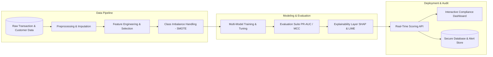

# 🛡️ Intelligent Anti-Money Laundering (AML) Transaction Monitoring System

<p align="center">
  <em>An end-to-end Machine Learning and Explainable AI (XAI) framework for detecting sophisticated financial crime, mitigating false positives, and providing regulatory transparency in real time.</em>
</p>

<p align="center">
  <a href="https://www.python.org/downloads/"></a>
  <a href="LICENSE"></a>
  <a href="https://github.com/navyavm123-sudo/AML-Transaction-Monitoring-ML/pulls"></a>
  <a href="https://github.com/psf/black"></a>
  <a href="#explainable-ai-xai"></a>
  <a href="#project-roadmap"></a>
</p>

---

## 📑 Table of Contents

- [Overview & Motivation](#-overview--motivation)
- [Key Features](#-key-features)
- [Project Objectives](#-project-objectives)
- [System Architecture](#-system-architecture)
- [Machine Learning Pipeline & Methodology](#-machine-learning-pipeline--methodology)
  - [1. Data Preprocessing & Feature Engineering](#1-data-preprocessing--feature-engineering)
  - [2. Class Imbalance Resolution](#2-class-imbalance-resolution)
  - [3. Model Benchmarking Suite](#3-model-benchmarking-suite)
  - [4. Evaluation Metrics Matrix](#4-evaluation-metrics-matrix)
  - [5. Explainable AI (XAI) for Compliance](#5-explainable-ai-xai-for-compliance)
- [Repository Structure](#-repository-structure)
- [Technology Stack](#-technology-stack)
- [Quickstart Guide](#-quickstart-guide)
  - [Prerequisites](#prerequisites)
  - [Installation](#installation)
- [Project Roadmap](#-project-roadmap)
- [Contributing](#-contributing)
- [Authors](#-authors)
- [Citation & License](#-citation--license)

---

## 📌 Overview & Motivation

Money laundering is an escalating systemic vulnerability for global financial systems. Traditional anti-money laundering (AML) workflows rely heavily on static, rule-based threshold filters (e.g., rigid transaction amount caps and basic velocity triggers). These legacy mechanisms suffer from severe limitations:

- **Excessive False Positive Rates (FPR)**: Typically exceeding **90–95%**, leading to massive alert fatigue, soaring operational costs, and wasted compliance officer hours.
- **Blindness to Advanced Typologies**: Inability to identify multi-hop layering networks, structuring (*smurfing*), rapid movement of illicit capital, and synthetic identities.

This open-source repository provides an **Intelligent AML Transaction Monitoring System** engineered using supervised machine learning algorithms, advanced imbalanced data handling, and regulatory-grade Explainable AI (XAI).

---

## ✨ Key Features

- 🔍 **Comprehensive Exploratory Data Analysis (EDA)**: Profiling of customer behaviors, transaction flows, and risk indicators.
- ⚙️ **Production Data Preprocessing**: Automated pipelines for missing data imputation, duplicate removal, outlier bounding, and encoding.
- 🧪 **Domain-Specific Feature Engineering**: Temporal velocity attributes, customer historical deviations, and cross-border risk scoring.
- ⚖️ **Imbalance Handling**: Advanced oversampling via **SMOTE**, **Borderline-SMOTE**, and cost-sensitive loss weighting.
- 🤖 **Multi-Model Benchmark**: Comprehensive training across 7 diverse ML algorithms (Logistic Regression, Decision Trees, Random Forest, SVM, XGBoost, LightGBM, and CatBoost).
- 🎛️ **Hyperparameter Optimization**: Automated tuning using Grid Search and Random Search.
- 📊 **Robust Evaluation Metrics**: Prioritization of metric reliability via **PR-AUC**, **MCC**, **Recall**, and **Confusion Matrices**.
- 💡 **Audit-Ready Explainability (XAI)**: Native integration of **SHAP** and **LIME** for transparent, explainable alert generation.
- 🌐 **Real-Time Web API & Dashboard**: Interactive compliance officer dashboard and low-latency inference endpoint.
- 🗄️ **Secure Database Layer**: Persistent schema for storing customer entities, transaction streams, AML alerts, and audit trails.

---

## 🎯 Project Objectives

This project follows a structured 12-point technical execution plan:

1. **Exploratory Data Analysis (EDA)**: Uncover hidden transaction distributions, velocity trends, and suspicious activity characteristics.
2. **Preprocessing Pipeline**: Robust handling of missing values, duplicates, outliers, categorical encoding, and numerical scaling.
3. **Feature Engineering & Selection**: Quantify the impact of domain-specific engineered features and selection algorithms.
4. **Class Imbalance Mitigation**: Evaluate synthetic sampling methods (e.g., SMOTE) on sparse AML positive labels.
5. **Model Development & Comparison**: Benchmark **Logistic Regression**, **Decision Trees**, **Random Forest**, **SVM**, **XGBoost**, **LightGBM**, and **CatBoost**.
6. **Hyperparameter Tuning**: Optimize model hyperparameters through Grid Search and Random Search.
7. **Multi-Metric Evaluation**: Assess models using Accuracy, Precision, Recall, F1-Score, ROC-AUC, PR-AUC, Confusion Matrix, and Matthews Correlation Coefficient (**MCC**).
8. **Explainable AI (XAI)**: Implement SHAP and LIME to generate local feature attributions and global model transparency.
9. **Real-Time Classification System**: Deploy an API capable of streaming and classifying incoming transactions as legitimate or suspicious.
10. **Interactive Compliance Dashboard**: Build visual interfaces for transaction statistics, customer risk profiles, and model performance tracking.
11. **Secure Database Architecture**: Design schemas for historical transactions, alerts, and audit logs.
12. **Rule-Based vs. ML Benchmarking**: Quantitatively validate the ML system's reduction of false positives against legacy rule-based engines.

---

## 🏗️ System Architecture



---

## 🔬 Machine Learning Pipeline & Methodology

### 1. Data Preprocessing & Feature Engineering
- **Data Sanitization**: Handling missing attributes, outlier detection, and categorical encodings (One-Hot & Target Encoding).
- **Engineered Financial Indicators**:
  - Velocity metrics: transaction counts and cumulative volume across sliding windows ($1\text{h}, 24\text{h}, 7\text{d}, 30\text{d}$).
  - Deviation ratios: transaction amount relative to account historical mean and standard deviation.
  - Geographic and jurisdictional risk flags.

### 2. Class Imbalance Resolution
Because suspicious AML transactions typically comprise $< 1\%$ of total volume, standard loss functions fail. We employ:
- **SMOTE** (Synthetic Minority Over-sampling Technique)
- **Borderline-SMOTE** & **ADASYN**
- **Cost-Sensitive Learning**: Class-weighted penalties on minority class misclassification.

### 3. Model Benchmarking Suite

| Category | Algorithm | Primary Strengths in AML |
| :--- | :--- | :--- |
| **Linear Baselines** | Logistic Regression | Highly interpretable, fast linear baseline |
| **Tree Ensembles** | Decision Trees, Random Forest | Captures non-linear feature splits, robust to outliers |
| **Kernel Methods** | Support Vector Machines (SVM) | Effective in high-dimensional transformed spaces |
| **Gradient Boosted Trees** | XGBoost, LightGBM, CatBoost | SOTA tabular performance, handles mixed data types and sparsity |

### 4. Evaluation Metrics Matrix
Given extreme class imbalance, traditional accuracy is misleading. The project prioritizes:
- **Precision-Recall Curve & PR-AUC**: Measures precision vs recall trade-off on sparse positives.
- **Recall (Sensitivity)**: Minimizes missed money laundering activities (False Negatives).
- **Precision**: Minimizes false alerts and analyst overhead (False Positives).
- **Matthews Correlation Coefficient (MCC)**: High-reliability score for imbalanced binary classifications.
- **ROC-AUC & Confusion Matrix**: Holistic threshold inspection.

### 5. Explainable AI (XAI) for Compliance
Financial regulations (e.g., FinCEN, FATF, GDPR right-to-explanation) require clear, auditable reasoning for flagged alerts:
- **SHAP (SHapley Additive exPlanations)**: Computes exact marginal feature contributions per decision.
- **LIME (Local Interpretable Model-agnostic Explanations)**: Builds local linear approximations around flagged transactions to provide concise reasons for compliance officers.

---

## 📂 Repository Structure

```text
AML-Transaction-Monitoring-ML/
│
├── data/
│   ├── raw/                 # Immutable source datasets
│   ├── processed/           # Cleaned, transformed, and feature-engineered datasets
│   └── external/            # External reference tables (risk indices, sanctions lists)
│
├── notebooks/
│   ├── 01_eda.ipynb                     # Exploratory Data Analysis & visual profiling
│   ├── 02_preprocessing_fe.ipynb        # Data cleaning, encoding, feature engineering
│   ├── 03_imbalance_handling.ipynb      # SMOTE and sampling experiments
│   ├── 04_model_benchmarking.ipynb      # Training & cross-validation of ML models
│   ├── 05_hyperparameter_tuning.ipynb  # Grid / Random Search optimization
│   └── 06_xai_interpretability.ipynb    # SHAP and LIME explanations
│
├── src/
│   ├── __init__.py
│   ├── config.py            # Global paths, constants, and hyperparameters
│   ├── data/                # Ingestion, validation, and preprocessing modules
│   ├── features/            # Feature computation pipelines and encoders
│   ├── models/              # Model training, hyperparameter search, evaluators
│   ├── explainability/      # SHAP / LIME visualizer utilities
│   └── utils/               # Logging, metrics calculation, and helpers
│
├── app/
│   ├── api/                 # REST API endpoints for real-time transaction scoring
│   ├── dashboard/           # Interactive UI for compliance monitoring
│   └── database/            # Database connectors, schemas, and ORM models
│
├── models_saved/            # Serialized models (.joblib, .json, .pkl)
├── tests/                   # Unit, integration, and data validation tests
├── requirements.txt         # Production and development dependencies
└── README.md                # Project documentation
```

---

## 🛠️ Technology Stack

- **Core & Runtime**: Python 3.10+
- **Data Processing**: Pandas, NumPy, SciPy
- **Data Visualization**: Matplotlib, Seaborn, Plotly
- **Machine Learning**: Scikit-Learn, XGBoost, LightGBM, CatBoost, Imbalanced-Learn
- **Explainable AI (XAI)**: SHAP, LIME
- **Web & Serving**: FastAPI, Uvicorn, Streamlit
- **Persistence**: SQLAlchemy, PostgreSQL / SQLite
- **Quality Assurance**: Pytest, Black, Flake8

---

## 🚀 Quickstart Guide

### Prerequisites
- Python 3.10 or higher
- Git

### Installation

1. **Clone the repository**:
   ```bash
   git clone https://github.com/navyavm123-sudo/AML-Transaction-Monitoring-ML.git
   cd AML-Transaction-Monitoring-ML
   ```

2. **Create and activate a virtual environment**:
   ```bash
   # Linux / macOS
   python3 -m venv venv
   source venv/bin/activate

   # Windows
   python -m venv venv
   venv\Scripts\activate
   ```

3. **Install dependencies**:
   ```bash
   pip install --upgrade pip
   pip install -r requirements.txt
   ```

---

## 🗺️ Project Roadmap

- [ ] **Phase 1: Exploratory Data Analysis (EDA)** — Distribution profiling and risk correlation.
- [ ] **Phase 2: Preprocessing & Feature Pipeline** — Imputation, outlier handling, and velocity feature engineering.
- [ ] **Phase 3: Class Imbalance Evaluation** — Implementation of SMOTE, ADASYN, and cost-sensitive loss.
- [ ] **Phase 4: Multi-Model Benchmark & Tuning** — Training 7 ML algorithms with Grid/Random hyperparameter search.
- [ ] **Phase 5: Explainability (XAI) Engine** — SHAP and LIME explainers for compliance auditing.
- [ ] **Phase 6: Web Application & Compliance Dashboard** — Real-time scoring API and interactive visual dashboard.
- [ ] **Phase 7: System Validation & Benchmarking** — Comparative benchmark against traditional rule-based filters.

---

## 🤝 Contributing

Contributions, issues, and feature requests are welcome! Feel free to check the [issues page](https://github.com/navyavm123-sudo/AML-Transaction-Monitoring-ML/issues).

1. Fork the repository
2. Create your feature branch (`git checkout -b feature/AmazingFeature`)
3. Commit your changes (`git commit -m 'Add some AmazingFeature'`)
4. Push to the branch (`git push origin feature/AmazingFeature`)
5. Open a Pull Request

---

## 👥 Authors

This project is developed and maintained by:

| Name | GitHub |
| :--- | :--- |
| Navya VM | [@navyavm123-sudo](https://github.com/navyavm123-sudo) |

📂 **Project Repository**: [navyavm123-sudo/AML-Transaction-Monitoring-ML](https://github.com/navyavm123-sudo/AML-Transaction-Monitoring-ML)

---

## 📜 Citation & License

Distributed under the **MIT License**. See [`LICENSE`](LICENSE) for more information.

```bibtex
@misc{aml_transaction_monitoring_ml,
  title={An Intelligent Anti-Money Laundering (AML) Transaction Monitoring System Using Machine Learning},
  author={Navya VM and Abhinav V,Anjana shankar},
  year={2026},
  publisher={GitHub},
  journal={GitHub repository},
  howpublished={\url{https://github.com/navyavm123-sudo/AML-Transaction-Monitoring-ML}}
}
```